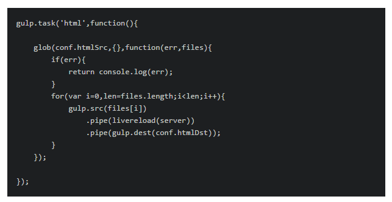
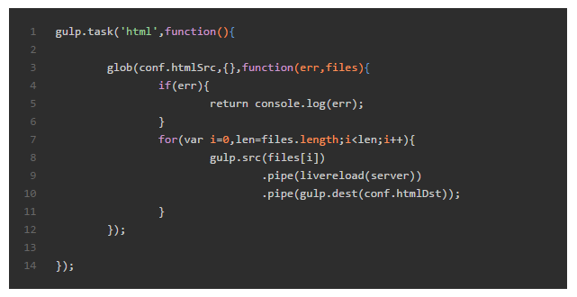

### 问题描述
我在搭建博客过程中，设置好了nextT主题的代码高亮配置之后，代码的显示是这样的：




<!--more-->

检查代码设置：

主题配置文件：_config.yml

```
highlight_theme: night eighties
```

设置的是这样没错。再看一下站点配置文件：_config.yml

```
highlight:
  enable: true
  line_number: true
  auto_detect: false
  tab_replace:
```

它这里的auto_detect默认使用的是false，那我就改成true试试呗！

```
highlight:
  enable: true
  line_number: true
  auto_detect: true
  tab_replace:
```

然后我hexo g,hexo s启动服务，打开一看，还是没有语法高亮。

查看了各种资料，在对比一下我的md文件书写方式，发现是我的md文件包裹代码块的方式错了，我用了tab缩进来构造代码块了。所以虽然html文档被解析成了代码块，有了黑色的背景，但是上边的文字却没有语法高亮，那是因为nextT主题没法识别tab缩进的代码块。所以我改成了这种：

``` code block ```

这种形式的就可以被识别了。

之后的显示情况如下：



另外，在这个过程中，我发现，启动hexo server服务的时候，我更改本地文件的时候，我可以不用使用hexo g命令来重新生成，也就是没必要重新启动服务来查看变化。它是实时变化的，你改了就可以看到的，跟puer类似。

好吧，博客系统终于搭建起来了，以后有时间就更新点东西玩玩。